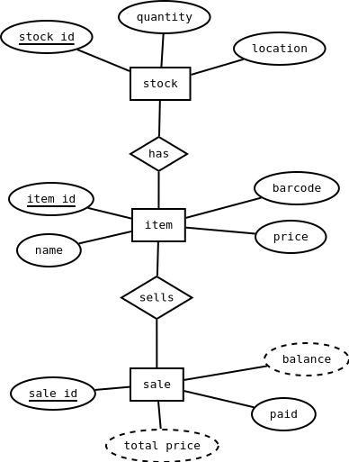
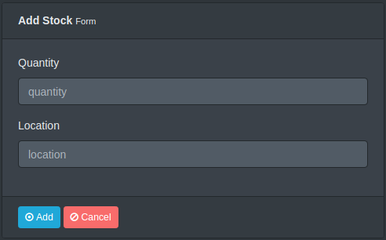
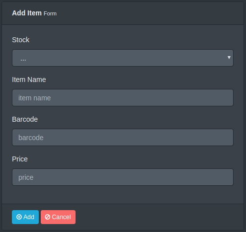
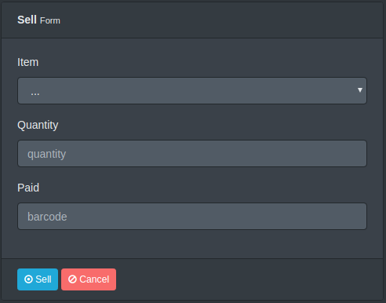

> Mohamed Usman, BIT B01,
MIC Kulhudhuffushi Campus, 2019

> Module: Software Engineering

# 
Shop Management System

##### 
Moving from a manual system to a computerized system - Case Study

## Introduction
A local shop is planning to improve their daily sales by tracking the profits they make each day. The current method of book keeping and sales tracking is cumbersome and they waste a lot of time during any working day. They now want to make their sales tracking more effective by moving to a computerized solution.

## Existing System
They currently do not have any accounting software to keep track of the items and sales. They use books to keep records of items they purchase and note down sales on books and do calculations manually.

## System Analysis
### Disadvantages of Existing System
- As the records are maintained in books, the manaul work is more and counter staff sometimes do not get the chance to write all sales.
- It is very difficult to do the calculations manually and sometimes they make mistakes in the calculations.
- There are no backups of the records and no way to backup them.

### Automation
Existing manual system will be converted to a computerized system. Calculations and data validation will be automatic by the computer in the sales counter.

### Advantages of New System
- Sales person can focus on the sale instead of writing on a book.
- Less chance of making human error because system will validate input data.
- Daily, monthly and yearly statistics can be taken for better business strategy.
- Information is more consistent.
- Regular backups can prevent losing of data after a breach.

## System Design
### Requirements Collection
Requirements will be collected through interviews, meetings, questionnaires and surveys.

### System Description
Counter staff will be able to
    - Enter stock items
    - Sell items
    - Print invoice
    - Get notified for items that need to be restocked

The new system will have 2 major components.
- Hardware

    The hardware will consist of the computer system on the counter and a printer to print bills.

- Software

    The software and the database will be in the computer system on the counter.

### Prototype
A prototype of the full system will be made to demonstrate the process of stocking and sales. This is not the final working product of the system.

## ER Diagrams

## Table & Forms
**stock table**

| NAME | DATA TYPE |
| --- | --- |
| stockid | int |
| quantity | int |
| location | varchar(20) |

**item table**

| NAME | DATA TYPE |
| --- | --- |
| itemid | int |
| stockid | int |
| name | varchar(50) |
| barcode | float |
| price | number(19,4) |

**sale table**

| NAME | DATA TYPE |
| --- | --- |
| saleid | int |
| itemid | int |
| quantity | int |
| paid | number(19,4) |

## Implementation
The software will be installed on the counter computer system. It will then be tested with dummy data for errors.

The existing stock items will be entered into the system after deleting the dummy data.

Counter staff will be trained to use the system.

## Maintenance
During the course of the system usage, it will be maintained by the development team to fix errors and to enhance its functionality. These are applied as updates or patches. The counter staff will report errors and also provide feedback and suggestions on how they want to improve the system.