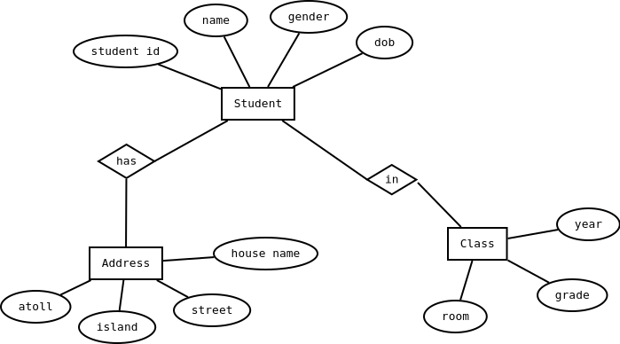
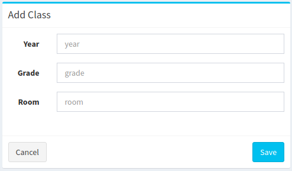
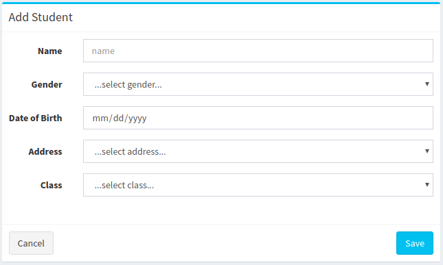
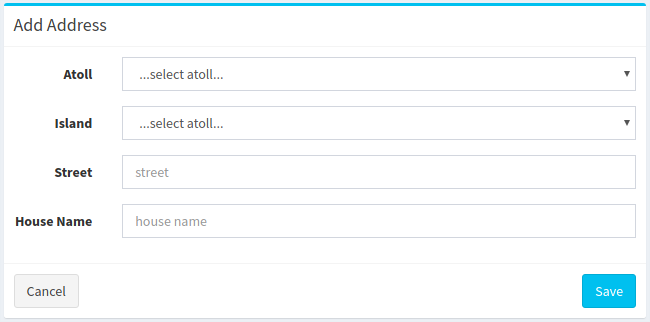

> Mohamed Usman, BIT B01,
MIC Kulhudhuffushi Campus, 2019

> Module: Software Engineering

# 
Student Admission System

##### 
Moving from a manual system to a computerized system - Case Study

## Introduction
A school is planning to make managing their students, more effective and efficient by using the current technologies available. They want to minimize the errors and problems they face when managing their students as the student population of the school increases each year.

## Existing System
They are currently using a very manual process to register and track all the information of the students. They are using lined books for record keeping. They have pages for student lists, addresses, classes and contact information.

## System Analysis
### Disadvantages of Existing System
- As the records are maintained in books, the manaul work is more, and more man power is needed.
- Updating records is difficult when information about a student is changed.
- Storage space is needed to keep the books safe.
- There are no backups of the records and no way to backup them.

### Automation
Existing manual system will be converted to a computerized system. Calculations and data validation will be automatic by the computers and servers used.

### Advantages of New System
- Fewer staffs are needed to maintain records.
- Less chance of making human error because system will validate input data.
- Not much space is needed as the records are stored in a server.
- Updating records are easier.
- Information is more consistent.
- Regular backups can prevent losing of data after a breach.

## System Design
### Requirements Collection
Requirements will be collected through interviews, meetings, questionnaires and surveys.

### System Description
Student services staffs will be able to
    - Register new students
    - Update students information when it changes
    - Archive students information when they leave the school

The new system will have 2 major components.
- Hardware

    The hardware will consist of the computer systems used by data enty staff and the server to host the backend services like databases and application programming interfaces.

- Software

    Software will have 3 components.
    - Frontend: will be used by the data entry staffs.
    - Backend: provides the interfacing between the frontend and the database.
    - Relational database management system: provides a structred data storage mechanism.

### Prototype
A prototype of the full system will be made to demonstrate the process of student registration, updating and archiving of student information. This is not the final working product of the system.

## ER Diagrams

## Tables & Forms
**student table**

| NAME | DATA TYPE |
| --- | --- |
| student_id | int |
| name | varchar(100) |
| gender | char(1) |
| dob | datetime |

**address table**

| NAME | DATA TYPE |
| --- | --- |
| address_id | int |
| atoll | varchar(5) |
| island | varchar(50) |
| street | varchar(50) |
| house_name | varchar(100) |
| type | varchar(20) |

**class table**

| NAME | DATA TYPE |
| --- | --- |
| class_id | int |
| year | int(4) |
| grade | int(2) |
| room | char(1) |

**add class form**

**add student form**

**add address form**

## Implementation
In the implementation process, the system is tested for errors before installing in the school.

A server will be purchased for use as the backend and the backend software is installed.

Frontend software will be installed on the computer systems in student services department.

Office staffs will be trained to use the system and all records on books will be entered into the system with the help of office staffs.

## Maintenance
During the course of the system usage, it will be maintained by the development team to fix errors and to enhance its functionality. These are applied as updates or patches. The users will report errors and also provide feedback and suggestions on how they want to improve the system.

---

# 
Shop Management System

##### 
Moving from a manual system to a computerized system - Case Study

## Introduction
A local shop is planning to improve their daily sales by tracking the profits they make each day. The current method of book keeping and sales tracking is cumbersome and they waste a lot of time during any working day. They now want to make their sales tracking more effective by moving to a computerized solution.

## Existing System
They currently do not have any accounting software to keep track of the items and sales. They use books to keep records of items they purchase and note down sales on books and do calculations manually.

## System Analysis
### Disadvantages of Existing System
- As the records are maintained in books, the manaul work is more and counter staff sometimes do not get the chance to write all sales.
- It is very difficult to do the calculations manually and sometimes they make mistakes in the calculations.
- There are no backups of the records and no way to backup them.

### Automation
Existing manual system will be converted to a computerized system. Calculations and data validation will be automatic by the computer in the sales counter.

### Advantages of New System
- Sales person can focus on the sale instead of writing on a book.
- Less chance of making human error because system will validate input data.
- Daily, monthly and yearly statistics can be taken for better business strategy.
- Information is more consistent.
- Regular backups can prevent losing of data after a breach.

## System Design
### Requirements Collection
Requirements will be collected through interviews, meetings, questionnaires and surveys.

### System Description
Counter staff will be able to
    - Enter stock items
    - Sell items
    - Print invoice
    - Get notified for items that need to be restocked

The new system will have 2 major components.
- Hardware

    The hardware will consist of the computer system on the counter and a printer to print bills.

- Software

    The software and the database will be in the computer system on the counter.

### Prototype
A prototype of the full system will be made to demonstrate the process of stocking and sales. This is not the final working product of the system.

## ER Diagrams

## Table & Forms
**stock table**

| NAME | DATA TYPE |
| --- | --- |
| stockid | int |
| quantity | int |
| location | varchar(20) |

**item table**

| NAME | DATA TYPE |
| --- | --- |
| itemid | int |
| stockid | int |
| name | varchar(50) |
| barcode | float |
| price | number(19,4) |

**sale table**

| NAME | DATA TYPE |
| --- | --- |
| saleid | int |
| itemid | int |
| quantity | int |
| paid | number(19,4) |

## Implementation
The software will be installed on the counter computer system. It will then be tested with dummy data for errors.

The existing stock items will be entered into the system after deleting the dummy data.

Counter staff will be trained to use the system.

## Maintenance
During the course of the system usage, it will be maintained by the development team to fix errors and to enhance its functionality. These are applied as updates or patches. The counter staff will report errors and also provide feedback and suggestions on how they want to improve the system.