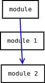

# 1) Introduction to Software Engineering
- Composed of 2 words, *software* and *engineering*.
- *Software* is more than just a program code.
- A program is an executable code, with some computational purpose.
- Software is considered to be a collection of executable programming code,
- *Engineering* on the other hand, is all about *developing products*, using *well-defined*, *scientific principles* and *methods*.

## Automation
- Changing of manual processes and tasks to computerized processes.
- All user activities are done through computerized method.
- Reduces user errors.
- Automation has 2 sections
    1. Frontend
    2. Backend
- The UI is commonly known as frontend.
- In frontend, user can interact with the system by forms and windows or the CLI (command line interface).

## The Need for the Software Engineering Discipline
- It arises because of higher rate of change in
    - user requirements and
    - environments on which software is working

1. **Large Software**
    - Programmers have to study the software carefully.
2. **Scalability**
    - If SE is not properly done, programmers cannot scale the existing software.
3. **Cost**
    - Costs can increase if proper process is not adopted.
4. **Dynamic Nature**
    - Due to the rapid changing nature of software, programmers have to seek new methodologies.
5. **Quality Management**
    - To ensure quality of software.

## DBMS Advantages
1. Redundancy can be avoided
    - Redundancy means duplication.
    - Duplicated values cannot be inserted/updated into the database.
    - Using the concept of "primary key", user can block repeating the of data.
    - Example: username
2. Inconsistency can be avoided
    - Various copies of same data may no longer agree in DB.
    - If user deletes/modifies records from master table, that change will be reflected in all sub tables.
    - Copies will not be kept in sub tables.
3. Integrity
    - The data values stored in the database must satisfy some conditions. Such conditions are known as integrity.
    - Example: Minimum balance of bank account = 500
4. Concurrent access anomalies
    - Multiple users can access the same database at once.
    - This is same technique as www.
    - User can access the database anywhere in the world and can do updates.
5. Atomicity
    - It means either operation is completely done or cancel the whole we did. (:p)
6. Security
    - There will be so many security measurements under DB.
    - When compared to file system, DB is rich in security.

## Software Problems
> Incomplete

## Characteristics of Good Software
### 1. Operational
1. **Budget**: cost effective software
2. **Usability**: usable or fit to be used software
3. **Efficiency**: ability to do things well with minimum resources.
4. **Dependability**: software must be trustworthy and reliable. Dependability is a measure of reliability, safety and security.
5. **Safety**: keep data from threats. Data, software and hardware should be protected from intruders.

### 2. Transitional
1. **Portability**: should be easily carried or moved
2. **Inter-operability**: ability to run on hardware from different vendors regardless of the physical architecture.
3. **Reusability**: must be reusable for the future. Should be able to modify for future changes in the requirements.

### 3. Maintainable
1. **Modularity**:
    - The degree to which a system component can be separated and recombined.
    - Software that's dividable into smaller modules.
2. **Maintainability**:
    - A failed equipment, machine or system can be restored to its normal operable state within a given timeframe.
3. **Flexibility**: Ability to change or changed according to the situation.

## Characteristics of the Software as a Process
> not found

## Characteristics of the Software as a Product
> not found

---

# 2) Software Development
## Software Engineering Goals
- The goals are easy to understand, but not easy to meet these goals.
- Because there are many ways to approach software engineering.
- The goals are to ensure that software is:
    - Readable
    - Correct
    - Reliable
    - Reusable
    - Extendable
    - Flexible
    - Efficient


## Importance of Software Engineering
### 1. Reduces complexity
- Big software are always complex and difficult to develop.
- Software Engineering divides big problems into smaller problems.
- Small problems are dealt with one by one and independent of each other.

### 2. To minimize software cost
- Requires a lot of hard work by highly paid professionals.
- Reduce tasks that are not required.

### 3. To decrease time
- No plan, wastes time.
- Software engineering has well defined plans for every aspect of the process.

### 4. Handling big projects
- To handle big projects without problems.

### 5. Reliable software
- Software should work according to the requirements.
- Bugs are fixed in testing and maintenance phase in software engineering.

### 6. Effectiveness
- Standards are defined to create effective software.

## Phases or Stages of Software Development Process
### 1. Planning
- First phase in software development.
- Checks whether there is the need for a new system.
- To find problems and determine solutions.

### 2. System Analysis
- Analyse the performance of a software by supplying various inputs.
- Checks whether all solutions fits the requirements.
- Requirement gathering.

### 3. System Design
- Clients (end-users) determine their information needs.
- Programmers create basic architecture.

### 4. Development
- Coding (real programming starts here).
- Using a high level programming language.
    - Low level language
        - Only 1s and 0s.
        - Another name is machine language.
    - Assembly language
        - English-like keywords are used
        - Example: add, sub, mul, div ... etc
    - High level language
        - Modern programming languages like C, C++, VB, Java

### 5. Integration and Testing
- Merging all modules as a whole system.
- Check all modules and integrate into one system.

### 6. Implementation
- Installation of newly created system.
- Old system is replaced by new system.

### 7. Maintenance
- Upgrade the system from time to time.
- To adapt changes.

## System Analyst
- Main person who is responsible for development of software / hardware.

### Roles of System Analyst
- A system analyst is responsible for designing and implementing system to fulfill organisational needs.
- He plays a vital role in making the management information systems operational.
- Some of his roles include
    1. Defining IT requirements
    2. Gathering data
    3. Analyze problem
    4. Setting priority to the jobs
    5. Problem solving
    6. Design system
    7. Evaluating system

### Skills required by the System Analyst
#### 1. Communication
The analyst needs to be a good communicator to understand and communicate to the user group and the technical group. Sometimes the user may not be able to communicate their needs fully to the analyst but the analyst must be able to understand their needs from imcomplete communication of the users.

#### 2. Adaptability
The anaylyst may be new to the environment of a particular business but he has to adapt fast to the culture and environment of the organization.

#### 3. Selling
The analyst needs to have ideas to sell their product to the users. Sometimes this may be difficult as the users and client might not know what solution will serve them best. The analyst needs to employ his selling skills to convince the users on the sutability of a solution.

#### 4. Patience
The analyst needs to be patient so that he does not rush to a solution. If they make quick solutions, they might miss critical information about the problem and end up with a wrong solution for the users.

#### 5. Sound temperament
The analyst needs to remain calm in all phases of a solution. Most of the time the critical data that the analyst seeks is hard to come and may be late in coming. The analyst will have to put up with all these and be calm in such situations.

#### 6. Foresightness
The analyst must have foresight envision, so that they can factor in the future requirements of the users even if they have to mentioned that in the design. The analyst must also have vision with regard to technological changes. System analyst must be able to predict where the business needs, technical capabilities, constraints will be in the future.

### Management Skills of a System Analyst
1. Time management skills
2. Project management skills
3. Man management skills
4. Team management skills
5. Directional skills
6. Negotiation skills
7. Leadership skills
8. Training skills
9. Documentation management skills
10. Presentational skills
11. Technical skills
12. Problem solving skills
13. Creativity skills

---

# 3) Software Development Process Model / Classical Waterfall Model
- Basic software development life cycle model.
- Simple but idealistic.
- Not used anymore.
- It is still important because all other models are based on this model.
- Divides the cycle into phases.
- One phase can only be started after the completion of the previous phase.
- The output of one phase will be the input to the next phase.

## Phases of Classical Waterfall Model
### 1. Feasibility Study
- The main goal of this phase is to determine whether it would be financially and technically feasible to develop the software.
- The feasibility study involves understanding the problem and then determine the various possible strategies to solve the problem.
- These different identified solutions are analyzed based on their benefits and drawbacks.
### 2. Requirements Analysis and Specification
### 3. Design
### 4. Coding and Unit Testing
### 5. Integration and System Testing
### 6. Maintenance

## Advantages
Some advantages are:
1. This model is very simple and easy to understand.
2. Phases in this model are processed one at a time.
3. each stage in the model is clearly defined.
4. This model has very clear and well understood milestones.
5. Process, actions and results are very well documented.
6. Reinforces good habits: define-before-design, design-before-code.
7. This model works for smaller projects and projects where requirements are well understood.

## Drawbacks
1. **No feedback path**: In this model, evolution of a software from one phase to another phase is like a waterfall. It assumes that no error is ever committed by developers during any phases. It does not incorporate any mechanisms for error correction.
2. **Difficult to accommodate change requests**: This model assumes that all the customer requirements can be completely and correctly defined at the beginning of the project, but actually customers’ requirements keep on changing with time. It is difficult to accommodate any change requests after the requirements specification phase is complete.
3. **No overlapping of phases**: This model recommends that new phase can start only after the completion of the previous phase. But in real projects, this can’t be maintained. To increase the efficiency and reduce the cost, phases may overlap
---

# 4) Software Development Life Cycle (SDLC)
- It is a *well defined*, *structured* sequence of *stages* in software engineering.

## Stages (Phases) of SDLC
### 1. Communication
- First step in SDLC.
- Initiate the request for software product.
- Try to negotiate the terms.
- Client gives all information to developers in writing.

### 2. Requirement Gathering
- Development team manages this stage.
- Developers collect more data from the client.
- Study the existing system with
    1. Questionnaires
    2. Interviews
- Developers collect answers from the questionnaires.

### 3. Feasibility Study
- Developers start designing a software in a cost-effective way.
- There are 4 types of feasibility study
    1. Technical feasibility
    2. Operational feasibility
    3. Economic feasibility
    4. Schedule feasibility

### 4. Detailed System Study
- Various operations are performed by the system and their relationship within and outside the system is studied.
- All the data is documented in
    1. Detailed Data Flow Diagrams
    2. Data Dictionary
    3. Logical Data Structures

### 5. System Design
- New system starts.
- Features of new system is designed.
- Cost of development is estimated.
- System Analyst selects best solution from all feasible solutions.

### 6. Coding
### 7. Testing
### 8. Implementation
### 9. Maintenance

## Testing
- Testing is a process of executing a program with the aim of finding errors.
- To make our software perform well, it should be error free.
- If testing is done successfully, it will remove all the errors from the program.

### Types of testing
#### 1. Unit testing
- It focuses on smallest unit of software design.
- Testers will check an individual unit or inter-related units.
- It is often done by the programmer.
- Software module is validated here.
- To make unit testing possible, program should be modular.

#### 2. Integrated testing
- Modules that pass unit testing are merged and done a complete system test.
- Integrated testing is divided into 2
    1. Top down
    2. Bottom up
- In top down, higher modules  are compared first. After that, it will move to the next level until it reaches the lowest level.
- In bottom up, lowest level modules are executed and checked and moves to the next higher level until the highest level is reached.

#### 3. Regression testing
- This type of testing make sure that whole components works properly even after addeing components (modules) to the complete system.
- If testing is failed, it will be rolled back to the previous state.
- If testing is successful, it will overwrite the system state.

#### 4. Alpha testing
- It is a validation testing.
- It is a type of acceptance testing which is done before product is released to the customer.
- Alpha test is done by developers.

#### 5. Beta testing
- This testing is done at client side to check the final output is error free or not.
- Beta test is conducted at one or more customer sites by the end user of the software.

#### 6. Browser compatibility test
- This type of testing is done at customer site.
- Customer will check all browsers are compatible with the new system.

#### 7. Back-end test
- This type fo testing is done at customer site.
- Customer will check all data are properly storing onto tables.

#### 8. Security testing
- It is a type of testing performed by a special team of testers.
- Security testing is done to check how software or application or website is secure from internal and external threats.
- It includes how much software is secure from malicious program, virus ... etc.

#### 9. Perfomance testing
- It is a type of testing in which client side will check the performance of the software within the context of the integrated system.
- It is used to test speed and effectiveness of the software.

#### 10. System testing
- It is a type fo testing in which client side will check the software works fine for different operating systems.
- Client will check the outputs without focusing on the internal workings.

## Debugging
- When errors are identified, it is necessary to identify the program statements responsible for errors and fix them.
- There are 4 types of debugging approaches.

### Types of debugging approaches
#### 1. Brute forece debugging
- It is the most common method but the least effective method.
- The program is loaded with print statements to print the intermediate values with the hope that some of the intermediate value will help us to catch the error.
- This approach becomes more systematic.
- Values of varibles can be easily checked and can set break points.

#### 2. Backtracking debugging
- This is also fairly common approach.
- Beginning from the statement at which an error is found, the source code is traced backwards until the error is discovered.
- Unfortunately, as the number of source lines to be traced back is increased, the number of potential backward path increases and may become unmanageable.

#### 3. Cause elimination debugging
- In this approach, a list of causes which could possibly have contributed to the error symptom, is developed and tests are conducted to eliminate each.

#### 4. Program slicing
- This technique is similar to backtracking.
- A slice of a program for a particular variable at a particular statement is the set of source lines preceding this statement that can influence the value of that variable.

---

# 5) Data Modeling
## System Elements
> Incomplete

## Cardinality and Modality
### Cardinality
- Cardinality describes that a data model must be able to represent the number of occurrences of an object in a relationship.
- It can be expressed in the pattern of 1 or many.
- For example, bank account having the tables, pan card and debit card holder. Each inidividual can have a unique pan card number and on the basis of it, that person could be in a one-to-one model relationship. Or several different accounts in different banks (one-to-many).

#### Different types of Cardinality
1. **One to One**
    - If one occurrence of object **A** can relate to one and only one occurrence of object **B**.
    

        

2. **One to Many**
    - If one occurrence of object **A** can relate to more than one occurrence of object **B**.
    

        

3. **Many to One**
    - If more than one occurrence of object **A** can relate to one occurrence of object **B**.
    

        

4. **Many to Many**
    - If more than one occurrence of object **A** can relate to more than one occurrence of object **B**.
    

        

### Modality
- Modality is completely different from cardinality.
- Its value is computed as zero when there is no requirement for a relationship to occur or if the relationship is optional.
- The modality value is one if there is an occurrence of relationship.
- In simple words, modality describes whether a relationship between 2 or more entities are required or not.


    

    > Note: Using modality, user will be able to know that entity sets are connectged or not. If connected its value = 1. If not connected, its value = 0.

## Entity Relationship Diagram
- ER modeling is a data modeling used in software engineering to produce conceptual data models.

### Components of ER diagram
1. Attribute
    - Entities are denoted using their properties known as attributes.
    - All attributes have values.
    - For example, student entity may have name, class, age, marks attributes.
    - There are 4 types of attributes.
        1. Key attribute
            - Uniquely identifies an entity among the entity set.
            - Can be an attibute or a collection fo attributes.
            - Example: roll number of a student: 2K19/BIT/003
            
                

            > Note: key attribute cannot be sub-divided
        2. Composite attribute
            - An attribute that is a combination of other attributes.
            - Another name is compound attribute.
            - This attribute can be sub-divided.
            - Example: student address
            
                

        3. Single-valued / multi-valued attribute
            - Single-valued attribute contains a single value only.
            - Example: election ID, national ID

            - Multi-valued attribute can have more than one value.
            - In ER diagram, multi-valued attributes are denoted by double ellipse.

                

        4. Derived attribute
            - These are attributes that does not exist in the physical database.
            - Their values are derived from other attributes present in the database.
            - Derived attributes are represented by dashed ellipse.

                

2. Entity and entity sets
    - An entitiy set is a collection of related types of entities.
    - An entity set may include entities with attributes sharing similar values.
    - An entity can be a real world object that can be identified easily.
    - Entities are represented as rectangles in ER diagrams.
3. Relationship
    - The association among entities are known as relationships.
    - They are represented by diamond shaped boxes.

        


    


### Degree of a relationship
- The number of participating entities in a relationship describes the degree of a relationship.
- There are 3 most common relationships in ER diagrams.
    1. Unary
        - Relationships between the instances of one entity type.
        - For example, one person is married to only one person.
    2. Binary
        - It is a relationship between the instances of 2 entity types.
        - Example: teacher teaches subject.
    3. Ternary
        - It is among instances of 3 entity types.
        - Teacher, student, subject are the examples of ternary relationship.

## Data Flow Diagram
- Graphical representation of flow of data.
- Capable of showing incoming, outgoing and stored data.

    

### Entity
- Entities are sources and destinations of information data.
- Entities are represented by rectangles with their respective names.

### Process
- Activities and actions taken on the data are represented by circle or round edged rectangles.

### Data Store
- There are 2 variants of data storage.
- It can either be represented as a rectangle with absence of both smaller sides or an open-sided rectangle with only one side missing.

### Data Flow
- Movement of data is shown by pointed arrows.
- Data movement is shown from the base of the arrow towards head of the arrow as destination.

    

### Levels of DFD
1. Level 0
    - Highest level of DFD
    - Shows the entire information system as one diagram.
    - Example:

        

2. Level 1
    - Level 0 is broken down to more specific level 1 modules.
    - Level 1 depicts basic modules in the system.
    - Level 1 DFD mentions basic process and source of information.
    - Example:

        

3. Level 2
    - At this level of DFD, data flows inside the module mentioned in level 1.

## Structure Chart
- Derived from DFD.
- Represents the system more detailed than DFD.
- Breaks down the entire system into lowest functional modules, describes functions and sub functions of each module of the system.
- Represents hierarchical structure of modules.
- At each layer, a specific task is performed.

### Symbols used under structure chart
1. Module: represents process or subroutine.
    
    

2. Condition:
    - It is represented by small diamond at base of the module.
    - It tells that control module can select any of subroutines based on some condition.
    
    

3. Jump: An arrow is shown pointing inside the module tells that the control will jump in the middle of the sub module.

    

4. Loop:
    - A curved arrow represents loop in the module.
    - Every sub module covered by loop repeat execution of module.

    

5. Data Flow:
    - A directed arrow with empty circle at the end represents data flow.

    

6. Control Flow:
    - A directed arrow with filled circle at the end represents control flow.
    
    


## Hipo Chart
- Developed by IBM in 1970.
- Represents the hierarchy of modules in the software system.
- System Analyst uses hipo diagram in order to obtain high level view of system functions.
- It decomposes functions into sub functions in a hierarchical manner.

    

## Structured English
- The description of what is required to the code and how to code it.
- Structured English helps the programmer to write error free code.
- It uses plain English words in structured programming method.
- It is not the ultimate code but a kind of description of what is required to code and how to code it.
- Example:
    ```
    enter Customer_Name<br>
    seek Customer_Name in Customer_Table
    if Customer_Name found then
        Call procedure User_Passwd
    else
        print Error_Message
        Call procedure New_Customer_Request
    end if
    ```

## Decision Tables
- A decision table represents conditions and the respective actions to be taken to address them in a structured table format.
- It is a powerful tool to debug and prevent errors.
- It helps similar information into a single table and then by combining tables, it delivers easy and convenient decision-making.
- Example:
    
    

    | condition | rule 1 | rule 2 | rule 3 | rule 4 |
    | ---       | :---:  | :---:  | :---:  | :---:  |
    | username  | F      | T      | F      | T      |
    | password  | F      | F      | T      | T      |
    | output    | E      | E      | E      | H      |
    T - correct<br>
    F - wrong<br>
    E - error<br>
    H - home screen

## Control Flow Graph
- A control flow graph is a graphical representation of control flow or computation during the execution of a program.
- Control flow graph is process-oriented.
- Control flow graph shows all the paths that can be traversed during program execution.

### General Control Flow Graph
#### 1. if-else


> Image Reference: https://www.geeksforgeeks.org/software-engineering-control-flow-graph-cfg/

#### 2. while


> Image Reference: https://www.geeksforgeeks.org/software-engineering-control-flow-graph-cfg/

#### 3. do-while


> Image Reference: https://www.geeksforgeeks.org/software-engineering-control-flow-graph-cfg/

#### 4. for


> Image Reference: https://www.geeksforgeeks.org/software-engineering-control-flow-graph-cfg/
---

# 6) Software Design Concepts
When user is creating a big system, user have to design both the frontend and backend.

There are so many design concepts which make a system reliable.

## 1. Modularity
- A software is separately divided into names and addressable components, sometimes they are called modules which integrate to satisfy the problem requirements.
- Modularity is the sigle attribute of a software that permits a program to be managed easily.

## 2. Information Hiding
- Modules must be specified and designed so that the information like algorithm and data presented in a module is not accessible for other modules not requiring that information.

## 3. Abstraction
- A collection of data that describes a data object is a data abstraction.
- A solution is made in large terms using the language of the problem environment at the highest level of abstraction.
- The lower level abstraction provides a more detailed description of the solution.

    > @todo: image here

## 4. Functional Independence
- It is the concept of separation and related to the concept of modularity.
- The functional independence is assessed using 2 criteria, cohesion and coupling.

### Coupling
Coupling is a measure that defines the level of inter-dependability among modules of a program.
It tells at what level, modules interfere & interact with each other.

#### Types of coupling
##### 1. Content coupling
When module can directly access, modify, refer to the other module contents, it is called content coupling.
##### 2. Common coupling
When multiple modules have read/write permission to global data is called common coupling.
##### 3. Control coupling
Two modules are control coupled if one of then decides the function of another one.
##### 4. Stamp coupling
When multiple modules share common data structures, it is called stamp coupling.
##### 5. Data coupling
When two modules interact with each other by passing data as arguments.

### Cohesion
Cohesion is a measure that defines the degree of intra dependability within elements of a module. The greater the cohesion, the better is the program design.

#### Types of Cohesion
##### 1. Co-incidental
It happens when big programs are divided into modules, for reducing the complexity of the program.

##### 2. Logical cohesion
When Logically categorized elements are categorized are put together into a module its in logical cohesion.

##### 3. Temporal cohesion
When elements of module are organized such that there process at a similar point in time it is called Temporal cohesion.

##### 4. Procedural cohesion
When elements of modules are grouped together which are executed sequentially in order to perform a task, it is called Procedural Cohesion.

##### 5. Communicational cohesion
When elements of modules are grouped together which are executed sequentially and work on same data it is called communication Cohesion.

##### 6. Sequential cohesion
When elements of modules are grouped together, the output of one serves as input to another, it is called sequential Cohesion.

##### 7. Functional cohesion
It is considered to be the highest degree of cohesion. Element of module functional cohesion are grouped because they all contribute to a single well defined function. It can also be reused.

## 5. Refinement
- It is the top down design approach.
- It is a process of elaboration.
- A hierarchy is established by decomposing a statement of function in a stepwise manner till the programming language statements are reached.

## 6. Architecture
- The complete structure of software is known as software architecture.
- The architecture is the structure of program modules where they interact with each other in a specialized way.
- The aim of the software design is to obtain an architectural framework of a system.

## Data Dictionaries
- It is a file or set of files that includes database information.
- In data dictionaries, the following information exist.
    1. **Name of data items**: fields
    2. **Aliases**: other names by which data items are called
    3. **Description**: textual description of what the data item is
    4. **Related data items**:
        - captures relationship between data items.
        - For example, total marks relate to internal marks and external marks
    5. **Range of values**:
        - records all possible values that is connected with the field.
        - For example, total marks must be positive and between 0 to 100.
    6. **Data structure definition**: data flows capture the name of processes that generate or receive the data item

### Mathematical operators used under Data Dictionary
<table>
<tr>
    <td>x = a + b</td>
    <td>x contain both a and b</td>
</tr>
<tr>
    <td>x = [a/b]</td>
    <td>x contains either a or b</td>
</tr>
<tr>
    <td>x = a X b</td>
    <td>x contains most entries from a</td>
</tr>
<tr>
    <td>x = y[a]</td>
    <td>x includes y more occurrence of a</td>
</tr>
<tr>
    <td>x = [a]z</td>
    <td>x includes z fewer occurrences of a</td>
</tr>
</table>

---

# 7) Maintenance
- It is a process of modifying a software after it has been delivered to the client.
- The main purpose of software maintenance is to modify and update software application after delivery to correct faults and to improve performance.

## Need for Maintenance
- Correct faults
- Improve design
- Implement enhancement
- Interface with other systems
- Migrate legacy software
- Accommodate programs so that different hardware, software and telecommunication facilities can be used.

## Categories of Software Maintenance
### 1. Corrective Maintenance
- It is concerned with fixing errors that are observed when software is in use.
- It is concerned with enhancing the system whn software is in use.

### 2. Adaptive Maintenance
- It is concerned with the change in the software that take place to make the software adapt to the new environment such as run in a new operating system.

### 3. Perfective Maintenance
- It is concerned with change in the software that occurs while adding new functionalities.
- A software product needed to support new features that users want to maintain or modify with the new features comes under perfective maintenance.

### 4. Preventive Maintenance
- This type of maintenance includes modifications and updations to prevent future problems of the software.
- It involves implementing changes to prevent the occurrence of errors.
- It goals to attend problems which are not significant at this moment but may cause serious issues in future.

## Implementation
- In this stage, physical system specifications are converted into a working solution.
- Implementation phase includes

#### 1. Coding
- Includes implementation of the design specified in the design document into executable programming language code.
- The output of the coding phase is the source code for the software that act as input to the testing and maintenance phase.

#### 2. Integration and Testing
- Includes detection of errors in software.
- The testing process will start with a test plan that recognise test related activities for testing.
- The output of the testing phase is the test report containing errors that occurred while testing the application.

#### 3. Installation
- The new system is installed and previous system is replaced completely.

### Trainings Under Implementation
- System operators must be trained properly so that they can handle all possible operations.
- The oprator should be trained in what common functions may occur, how to recognise them, and what steps to take when an error comes.
- End-user training is an important part of the computer based information system which must be provided to employees to enable them to do their own problem solving.
- User training involves how to operate the system, troubleshooting the system, check whether a problem that arises is caused by the equipment or software.

#### Training Methods
##### 1. Instructor-lead training
- It involves both trainers and trainees, who have meet at the same time, but not necessarily at the same place.
    1. Visual Classroom
        - Trainers must meet the trainees at the same time, but not required to be at the same place.
        - The primary tool used here are video conferencing, text based, internet relay chat or virtual reality.
    2. Normal Classroom
        - The trainers must meet the trainees at the same time and place.
        - The primary tools used here are blackboard, projectors.
##### 2. Self-paced training
- It needs trainers and trainees, who do not meet at the same location or at the same time.
- The trainees learn the skills themselves by accessing the courses at their own convenience.
- It is divided into
    1. Multimedia training
        - Courses are presented as multimedia format and shared on CD ROM.
        - It minimizes the cost in developing on in-house training course without assistance from external programmers.
    2. Web based
        - Courses are often presented in hypermedia format and developed to support internet and intranet.
        - Provides just-in-time training for end-users.

### Conversion
- A process of migrating from the old system to the new system.
- There are 4 types of conversion methods.
    1. **Parallel Conversion**
        - Old and new systems are used simultaneously.
        - Both old and new system results are compared.
        - Only if the organization accepts, old system is gradually replaced by the new system.
        - Provides a fallback when new system fails.
        - If all functions are properly working, new system will slowly take over the business.
        - *Advantages*
            - Offers great security.
            - Small minor errors can be easily seen.
            - Companies are able to fix any problems with the new system before ending the previous system.
    2. **Direct cut over conversion**
        - New system is implemented and old system is completely replaced.
        - Less costly.
        - Not time consuming.
        - Focuses users to make new system work.
        - Disadvantage is that no backtracking, if any problems arises.
        - Requires most careful planning.
    3. **Pilot conversion**
        - Supports phased approach that gradually implements system across all user.
        - Used for testing the new system in different environments.
        - Helpful for organizations which have several physical locations.
        - Risk is reduced.
        - Allows training and installations without unnecessary use of resources.
    4. **Phase-in method**
        - Working version of system is implemented in one part of the organization and based on feedback, it is installed throughout the organization all at once or stage by stage.
        - Different from pilot as pilot conversion tests one location and then implements in whole, module by module.

## Integration Test Approaches
- There are 4 types of integration test approaches.

### 1. Big Bang Approach
- It is the simplest integration approach.
- All modules are tested in a single step.
- In other words, all modules are put together and tested at the same time to check for errors.
- The disadvantage is that if user finds an error, it is very difficult to localize the error.
- Debugging errors during big bang is difficult.

### 2. Top-down Approach
- Top-down integration testing starts with the main routine and one or two sub routines in the system.
- After this has been completed, system will check if there is any level 2.
- Top-down integration testing requires the use of program modules to simulate the effect of lower level routines that are called by the routines under test.

### 3. Bottom-up Approach
- In bottom-up testing, each subsystem is tested separately and then full system is tested.
- A subsystem might consist of many modules which communicate among each other through well defined interfaces.
- Both control and data interfaces are tested.

### 4. Mixed Approach
- It's rarely used integration approach.
- Under this type of approach, both bottom-up and top-down are done concurrently.
- This approach is time consuming.
---

# 8) Computer Aided Software Engineering (CASE)
> not found


---

> Will put this part to somewhere later
## Requirement Analysis & Specification
The process of gathering the software requirements from the client.

It has 4 steps
1. Feasibility Study: Feasibility study is used to select a feasibile solution which follows all the user requirements.

The output of this phase should be a feasible output report which contains all user requirements.

2. Requirement gathering: getting information from client.
Types of information gathering
    1. Interview
        - a. One to One interview
        - b. Written interview
        - c. Oral interview
        - d. Group interview
    2. Surveys: Organization may conduct surveys about their expectations and needs from the upcoming system.
    3. Questionnaires: A document with a predefined set of objective questions and respective options is used to get information from the client.
    4. Brainstorming: An informational debate is held among the organization. Inputs are stored onto the database during this procedure.
    5. Prototype: It is building user interface without adding detail functionality. It helps use to give a better idea about the system. Using prototype model, user will understand the system working in a rough way.

3. Software Requirement Validation: After requirement specifications are developed, the requirements mentioned in the document are validated.
    - All features can be practically implemented or not.
    - All features are clear and complete.
4. Requirement Elicitation Process:
    - System Analyst will get information from the client and they prioritize and arrange the requirements in order of importance and urgency.
    - All these requirments are discussed with the organization and then be changed the priority of requirements.